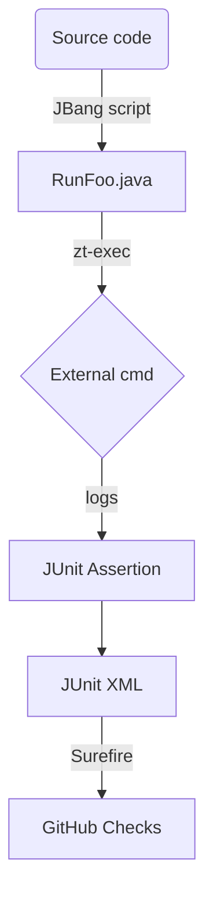

# Spring AI Examples — Automated Testing Plan (v2)
### With JBang, JUnit 5 & ZeroTurnaround zt-exec for robust process control

---

## 1. Objectives

| Goal | Why it matters |
|------|----------------|
| Guarantee every example builds & runs on every Spring AI release | Avoid silent breakage across ~30 modules |
| Provide **self-contained Java smoke tests** (no Bash) | Cross-platform, integrates with Maven Surefire & IDEs |
| Use **zt-exec** for process execution (Maven, Docker, etc.) | Fluent API, built-in timeouts, output capture |
| Keep developer UX simple (`./RunFoo.java` or `./mvnw test`) | Fast local feedback, predictable CI behaviour |
| CI pipeline that fails fast yet scales horizontally | Support parallel jobs, secret handling, caching |

---

## 2. Tooling Stack

| Layer | Choice | Rationale |
|-------|--------|-----------|
| Script runner | **JBang** | One-file, shebang-style Java; zero build step |
| Test framework | **JUnit 5** + Spring-Boot-Test | Native to JVM ecosystem; Surefire XML output |
| Process mgmt | **zt-exec** (`org.zeroturnaround:zt-exec:1.12`) | Concise API (`ProcessExecutor`) with timeout + log streaming |
| Containers | **Testcontainers** | Spin-up deps inside the test JVM (DB/LLM mocks) |
| Metadata | `ExampleInfo.java` interface per module | Single source for TIMEOUT, ports, success regex |
| CLI helper | `Run*.java` JBang launcher | Mirrors Bash UX but uses zt-exec under the hood |
| CI | GitHub Actions matrix (`tier` × `jdk`) | Automatic scaling; secret scoping via Environments |

---

## 3. Architecture & Flow



1. **`RunExample.java`** (JBang) orchestrates build + run using `ProcessExecutor`.
2. A thin **JUnit test** calls `RunExample.main()` and fails on non-zero exit.
3. `ExampleInfo.java` constants feed both the JBang script and the JUnit assertions.
4. CI workflow discovers examples, spawns matrix jobs, caches Maven repo & Testcontainers layers.

---

## 4. Module Conventions

```
agentic-patterns/
└── evaluator-optimizer/
    ├── pom.xml
    ├── src/...
    ├── ExampleInfo.java                 # metadata
    ├── RunEvaluatorOptimizer.java       # JBang launcher (zt-exec)
    └── EvaluatorOptimizerSmokeTests.java # JUnit 5
```

### `ExampleInfo.java` (template)

```java
public interface ExampleInfo {
    int TIMEOUT_SEC = 300;
    String[] SUCCESS_REGEX = {
        "EVALUATION:\\s+PASS",
        "FINAL OUTPUT:"
    };
    int SERVER_PORT = 0; // Let Spring Boot choose random port
    String[] REQUIRED_ENV_VARS = {"OPENAI_API_KEY"};
}
```

---

## 5. JBang Launcher Template (uses zt-exec)

```java
///usr/bin/env jbang "$0" "$@" ; exit $?
//DEPS org.zeroturnaround:zt-exec:1.12
//JAVA 17
//FILES mvnw ExampleInfo.java

import static java.lang.System.*;
import java.nio.file.*;
import org.zeroturnaround.exec.*;

public class RunEvaluatorOptimizer implements ExampleInfo {

  public static void main(String... args) throws Exception {
    Path dir = Paths.get(".").toAbsolutePath();

    section("Building module");
    exec(dir, "./mvnw", "clean", "package");

    section("Running Spring Boot app");
    Path log = Files.createTempFile("evaluator", ".log");
    int exit = new ProcessExecutor()
        .command("./mvnw", "spring-boot:run")
        .directory(dir.toFile())
        .redirectOutput(log.toFile())
        .redirectErrorStream(true)
        .timeout(TIMEOUT_SEC, java.util.concurrent.TimeUnit.SECONDS)
        .execute()
        .getExitValue();

    if (exit != 0) fail("Run finished with exit " + exit);

    section("Verifying output");
    String out = Files.readString(log);
    for (String regex : SUCCESS_REGEX) {
      if (!out.matches("(?s).*" + regex + ".*")) fail("Missing: " + regex);
      ok("✓ " + regex);
    }
    ok("\\nAll checks passed!");
    Files.deleteIfExists(log);
  }

  /* ---------- helpers ---------- */
  static void exec(Path dir, String... cmd) throws Exception {
    int exit = new ProcessExecutor().command(cmd)
        .directory(dir.toFile())
        .redirectOutput(ProcessBuilder.Redirect.INHERIT)
        .redirectError(ProcessBuilder.Redirect.INHERIT)
        .execute().getExitValue();
    if (exit != 0) fail("Command failed: " + String.join(" ", cmd));
  }
  static void section(String s){ out.println("\\u001B[33m== "+s+" ==\\u001B[0m"); }
  static void ok(String s){ out.println("\\u001B[32m"+s+"\\u001B[0m"); }
  static void fail(String m){ err.println("\\u001B[31m"+m+"\\u001B[0m"); exit(1); }
}
```

---

## 6. JUnit 5 Integration Template

```java
package com.example.agentic;

import org.junit.jupiter.api.Test;
import org.junit.jupiter.api.Timeout;
import org.zeroturnaround.exec.ProcessExecutor;
import static org.junit.jupiter.api.Assertions.*;
import java.util.concurrent.TimeUnit;

public class EvaluatorOptimizerSmokeTest implements ExampleInfo {

    @Test
    @Timeout(value = TIMEOUT_SEC, unit = TimeUnit.SECONDS)
    void shouldRunSuccessfully() throws Exception {
        int exitCode = new ProcessExecutor()
            .command("jbang", "./RunEvaluatorOptimizer.java")
            .execute()
            .getExitValue();
        
        assertEquals(0, exitCode, "Example should complete successfully");
    }
}
```

---

## 7. Implementation Timeline

| Week | Phase | Deliverables |
|------|-------|--------------|
| **1** | Foundation | • Add `ExampleInfo.java` to 3 pilot modules<br>• Create **Run\*.java** scripts using zt-exec<br>• Confirm local execution (`jbang ./RunFoo.java`) |
| **2** | Pilot Testing | • Write generic `AbstractExampleSmokeTest` that invokes JBang launcher<br>• Integrate with Maven Surefire; generate JUnit XML<br>• Test pilot examples end-to-end |
| **3** | Tier 1 Expansion | • Convert remaining **simple examples** (~10 modules)<br>• Create JBang helper to scaffold new modules (`jbang init-example.java`)<br>• Basic GitHub Actions workflow |
| **4** | Complex Integration | • Build custom JUnit **`@LaunchServer`** extension for in-JVM server tests<br>• Convert client/server examples (MCP modules)<br>• Add Testcontainers for database dependencies |
| **5** | MCP & Advanced | • Complete all MCP examples with container support<br>• Implement **GitHub Actions** matrix (`tier`, `jdk`) with caching<br>• Add environment variable management |
| **6** | Legacy Migration | • Delete legacy Bash scripts once parity achieved<br>• Update **CLAUDE.md** & repo README with new commands<br>• Performance optimization pass |
| **7** | Polish & Launch | • Flakiness audit; tighten timeouts<br>• Add markdownlint & README generator<br>• First full-suite run against release candidate |

---

## 8. Example Categories & Complexity Tiers

### Tier 1: Simple Examples (~12 modules)
- `kotlin/kotlin-hello-world`
- `models/chat/helloworld`
- `misc/openai-streaming-response`
- `misc/spring-ai-java-function-callback`
- `kotlin/kotlin-function-callback`
- `prompt-engineering/prompt-engineering-patterns`

**Testing Pattern**: Basic build → run → output verification

### Tier 2: Moderate Examples (~10 modules)
- `agentic-patterns/chain-workflow`
- `agentic-patterns/routing-workflow`
- `agentic-patterns/orchestrator-workers`
- `agentic-patterns/parallelization-workflow`
- `agents/reflection`

**Testing Pattern**: Pattern matching, timing checks, multi-step verification

### Tier 3: Complex Examples (~15 modules)
- `model-context-protocol/sqlite/*`
- `model-context-protocol/weather/*`
- `model-context-protocol/brave*`
- `model-context-protocol/web-search/*`
- `kotlin/rag-with-kotlin`

**Testing Pattern**: External dependencies, container management, API validation

---

## 9. CI/CD Workflow (GitHub Actions)

```yaml
name: Spring AI Examples Smoke Tests

on:
  pull_request:
  push:
    branches: [main]
  schedule:
    - cron: '0 6 * * *'  # Daily at 6 AM

jobs:
  discover:
    runs-on: ubuntu-latest
    outputs:
      examples: ${{ steps.find.outputs.matrix }}
    steps:
      - uses: actions/checkout@v4
      - name: Find examples with ExampleInfo.java
        id: find
        run: |
          examples=$(find . -name "ExampleInfo.java" -exec dirname {} \; | jq -R -s -c 'split("\n")[:-1]')
          echo "matrix=$examples" >> $GITHUB_OUTPUT

  test:
    needs: discover
    strategy:
      fail-fast: false
      matrix:
        example: ${{ fromJson(needs.discover.outputs.examples) }}
        jdk: [17, 21]
    runs-on: ubuntu-latest
    timeout-minutes: 30
    steps:
      - uses: actions/checkout@v4
      
      - name: Set up JDK ${{ matrix.jdk }}
        uses: actions/setup-java@v4
        with:
          distribution: 'temurin'
          java-version: ${{ matrix.jdk }}
          cache: 'maven'
      
      - name: Install JBang
        run: |
          curl -Ls https://sh.jbang.dev | bash -s - app setup
          echo "$HOME/.jbang/bin" >> $GITHUB_PATH
      
      - name: Run smoke test
        env:
          OPENAI_API_KEY: ${{ secrets.OPENAI_API_KEY }}
        run: |
          cd ${{ matrix.example }}
          jbang ./Run*.java
      
      - name: Run JUnit tests
        run: |
          cd ${{ matrix.example }}
          ./mvnw test
```

---

## 10. Success Metrics

| Metric | Target | Measurement |
|--------|--------|-------------|
| Modules with **ExampleInfo + Run\*.java + JUnit** | ≥ 95% | Count of compliant modules / total modules |
| CI wall-clock on cache-warm run | ≤ 25 min | GitHub Actions workflow duration |
| Flaky test rate over last 10 runs | < 2% | Failed runs / total runs (excluding real failures) |
| Manual steps before a release | 0 | Process documentation audit |
| Cross-platform compatibility | Windows + Linux + macOS | CI matrix results |

---

## 11. Risk Mitigation

| Risk | Impact | Likelihood | Mitigation |
|------|--------|------------|------------|
| zt-exec Windows path issues | Medium | Low | CI matrix includes windows-latest; escape paths properly |
| LLM API rate limits in CI | High | Medium | Replace with local-ai Testcontainer for smoke tests |
| Port collisions in parallel | Medium | Medium | Use `server.port=0` + `@LocalServerPort` injection |
| JBang installation complexity | Low | Low | Pre-install in CI; document local setup clearly |
| Test execution timeouts | Medium | Medium | Tune timeouts per complexity tier; fail fast |

---

## 12. Development Workflow

### For New Examples
1. Create `ExampleInfo.java` with appropriate timeouts and success patterns
2. Generate `Run*.java` using scaffolding tool: `jbang init-example.java MyExample`
3. Create corresponding JUnit test extending `AbstractExampleSmokeTest`
4. Test locally: `jbang ./RunMyExample.java`
5. Verify CI integration: `./mvnw test`

### For Existing Examples
1. Analyze current bash script patterns and success criteria
2. Create `ExampleInfo.java` based on analysis
3. Port bash logic to JBang + zt-exec pattern
4. Add JUnit wrapper test
5. Validate parity before removing bash script

---

## 13. Next Steps

### Immediate (Week 1)
- [ ] Set up development environment with JBang + zt-exec
- [ ] Create `ExampleInfo.java` template and validation rules
- [ ] Prototype conversion of `kotlin-hello-world` example
- [ ] Design `AbstractExampleSmokeTest` base class

### Short-term (Weeks 2-3)
- [ ] Implement scaffolding tool for new examples
- [ ] Convert 3 pilot examples across complexity tiers
- [ ] Set up basic GitHub Actions workflow
- [ ] Document migration process in CLAUDE.md

### Medium-term (Weeks 4-7)
- [ ] Complete conversion of all examples
- [ ] Add Testcontainers integration for complex examples
- [ ] Optimize CI performance and caching
- [ ] Remove legacy bash scripts and update documentation

---

## 14. Appendix: Code Templates

### init-example.java (Scaffolding Tool)
```java
///usr/bin/env jbang "$0" "$@" ; exit $?
//DEPS info.picocli:picocli:4.7.0

import picocli.CommandLine;
import java.nio.file.*;

@CommandLine.Command(name = "init-example")
public class InitExample implements Runnable {
    @CommandLine.Parameters(index = "0")
    String exampleName;
    
    public void run() {
        // Generate ExampleInfo.java
        // Generate Run{ExampleName}.java  
        // Generate JUnit test
        // Update .gitignore if needed
    }
}
```

### AbstractExampleSmokeTest.java
```java
public abstract class AbstractExampleSmokeTest {
    protected abstract String getRunScript();
    protected abstract Duration getTimeout();
    
    @Test
    void smokeTest() throws Exception {
        // Standard JBang execution logic
        // Timeout handling
        // Exit code verification
    }
}
```